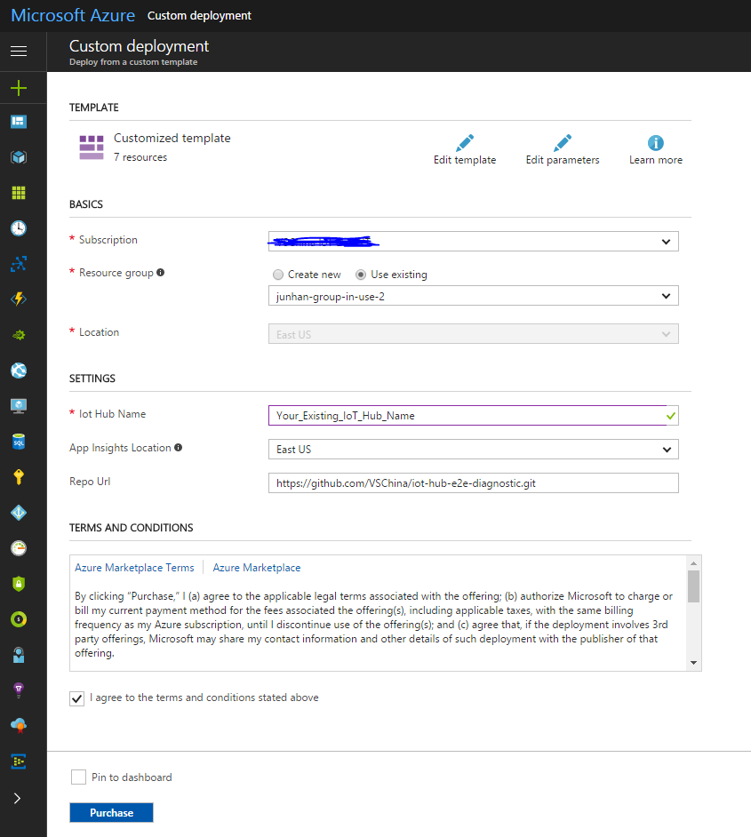
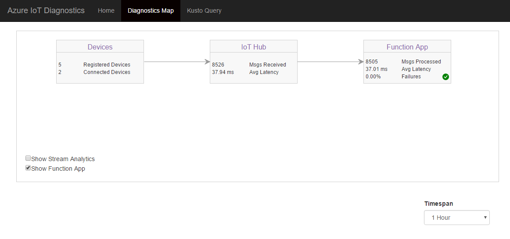

## Provision diagnostics resources using ARM template

1. Navigate to [e2e diagnostics repo](https://github.com/VSChina/iot-hub-e2e-diagnostic/tree/devkit_shakeshake)
2. Click **Deploy to Azure**, it will navigate to azure portal
3. Select subscription and resource group that existing IoT Hub belongs to, and enter your existing IoT Hub name

5. Select the checkbox "*I agree to terms and conditions stated above*"
6. Click **Purchase**

## Modify existing IoT Hub

Follow this [instruction](https://github.com/VSChina/iot-hub-e2e-diagnostic/blob/tutorial/Guide%20to%20Update%20Existing%20IoT%20Hub%20and%20ASA/Guide%20to%20Update%20Existing%20IoT%20Hub%20and%20SAS.md#modifying-existing-iot-hub).

## Config Application Insights api keys in Web App

Follow this [instruction](https://github.com/VSChina/iot-hub-e2e-diagnostic/blob/tutorial/NetNew_How%20to%20Config%20Application%20Insights%20in%20Web%20APP/Guide%20to%20Config%20Application%20Insights%20Keys%20in%20Web%20APP.md).

## Update existing Azure Functions

1. Open your Azure portal, and go to Application Insights. Keep a record of Instrumentation Key shown in the picture below:

2. Open Azure Function -> Your Azure Function -> Application settings, add App settings:

|         App Settings Key         |                 App Settings Vaule                  |
|----------------------------------|-----------------------------------------------------|
| APP_INSIGHTS_INSTRUMENTATION_KEY | Instrumentation Key obtained from step 1   |

## Modify your code of existing Azure Functions

Add Application Insights code in your Azure Functions to track Azure Functions status, refer to this [commit](https://github.com/VSChina/iot-hub-e2e-diagnostic/commit/17156f2bbef786a8a83e98d16e397758d57b14b3).

## View the Diagnostics Map

Open Web App, and go to the 'Diagnostics Map' tab.

