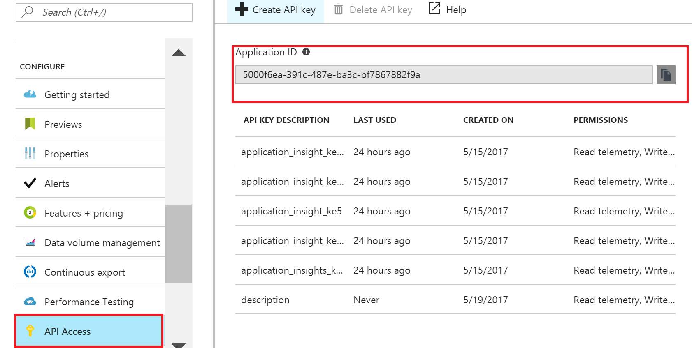
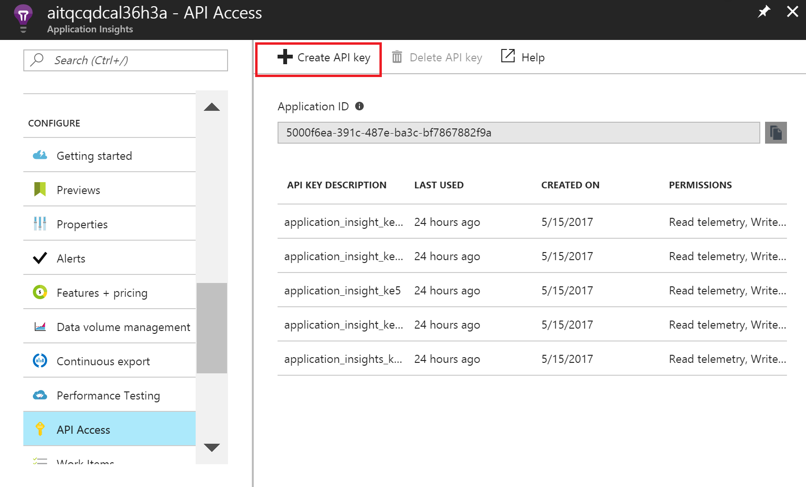
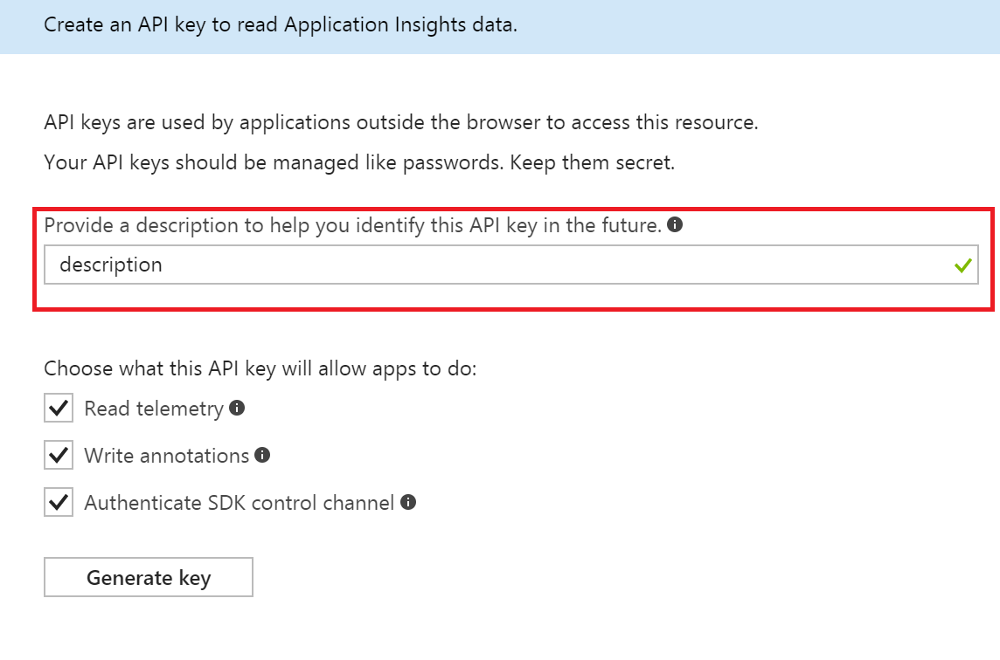
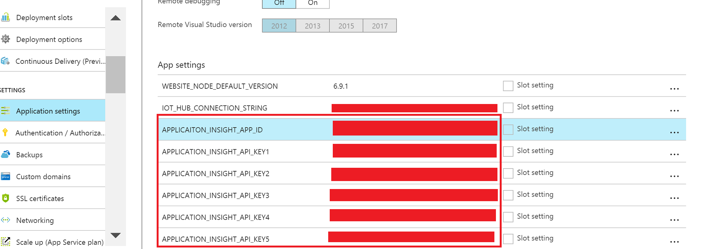

## Configure Web App
In order to track the behaviors of Web APP correctly with Application Insights, there are some required settings need to be configured manually.

First of all, *Application ID* of the Application Insights must be set in the Web APP. Besides, there are several API Keys the Web APP need to use.

1. Get the Application ID

    Find the Application Insights deployed by the ARM Template, click **API Access** in the left panel under **CONFIGURE**, the *Application ID* just shows in right panel.

    Copy it and we will use it later.

    

2. Create Application Insights API Keys

    Stay in the **API Access** panel, click the **Create API Key** button:

    

    Provide a description in the pop up panel to help you identify this API Key in the future.
    Check all permission that the API Key will allow apps to do.

    Then click **Generate key**.

    **Make sure you copy the key immediately.** You won't see it again once you close the panel.

    Repeat the actions several times depending on the number of keys requried (We need **5** API Key for our scenario). And please make sure you copy the API Key immediately after it is generated.

    

3. Config the API Key in Web APP

    Go to the Web APP deployed by ARM template that will leverage the Application Insights, click the **Application settings** in the left panel, scroll down to App Settings.
    Fill in Application Id got in step 1 to **APPLICATION_INSIGHT_APP_ID**
    Fill in the five API keys got in step 2 to **APPLICATION_INSIGHT_API_KEY1~5** correspondingly.

    Click the **Save** button in the left top to save all the settings.

    