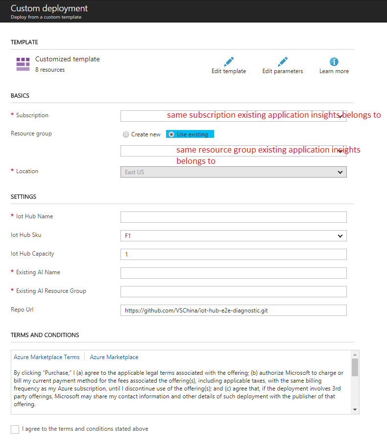

# Guide to Setup E2E Diagnostics Solution with Existing Application Insights

## Provision diagnostics resources using ARM template
1. Navigate to [e2e diagnostics repo](https://github.com/VSChina/iot-hub-e2e-diagnostic/tree/existing_AI)
2. Click **Deploy to Azure**, it will navigate you to azure portal

3. Select subscription
4. Select existing resource group
5. Type in an IoT Hub name that you want to create
6. Select the IoT Hub sku level
7. Fill in the existing application insights name and the resource group name that it belongs to
8. Check "*I agree to terms and conditions stated above*"
9. Click **Purchase** to trigger the deploy

## Configure application insights keys in Web App
After all resources deployed successfully, find the existing application insights, copy the application id, generate necessary application keys and paste them in corresponding place following this link:
[Configure Application Insights Keys in Web App](./Guide%20to%20Config%20Application%20Insights%20Keys%20in%20Web%20APP.md)