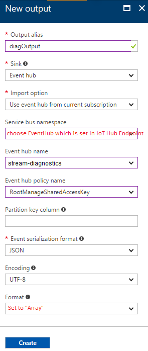

# Setup E2E Diagnostics Solution With Existing IoT Hub and Stream Analytics
## Provision diagnostics resources using ARM template
1. Navigate to [E2E Diagnostics Repo](https://github.com/VSChina/iot-hub-e2e-diagnostic/tree/existing_HUB_SA)
2. Click **Deploy to Auzre**
3. Use the same subscription and resource group that your existing IoT Hub and Stream Analytics use

   
4. Use two lower case letters as prefix for provisioned resources to distinguish them from other resources
5. Check "*I agree to terms and conditions stated above*"
6. Click **Purchase**

## Modify Existing IoT Hub
Please refer to [Modify Existing IoT Hub](./Modify%20Existing%20IoT%20Hub.md)

## Modify Existing Stream Analytics Job
1. Open the existing Stream Analytics Job in Azure portal, make sure to use this portal [https://portal.azure.com/?feature.customportal=false](https://portal.azure.com/?feature.customportal=false) to workaround a known Azure issue
2. Go to **Overview** tab and click *Stop* to stop streaming job
3. Navigate to **Outputs** tab under *JOB TOPOLOGY*
4. Click *Add* to add a new output, fill in all necessary items then click *Create*

   
5. Navigate to **Query** tab under *JOB TOPOLOGY*, append the following query at the end of existing query, replace *Input* and *diagOutput* with your input and output:
    ```sql
    SELECT
        *, GetMetadataPropertyValue([Input], '[User].[x-correlation-id]') AS 'x-correlation-id',
        System.Timestamp AS 'processed-utc-time'
    INTO
        [diagOutput]
    FROM
        [Input]
    WHERE 
        GetMetadataPropertyValue([Input], '[User].[x-correlation-id]') IS NOT NULL
    ```
6. Click *Save* to save the changes
7. Switch to **Overview** tab, click *Start* to start streaming job

## Configure Web App
Please refer the document [Configure Application Insights Keys in Web App](./Guide%20to%20Config%20Application%20Insights%20Keys%20in%20Web%20APP.md)
