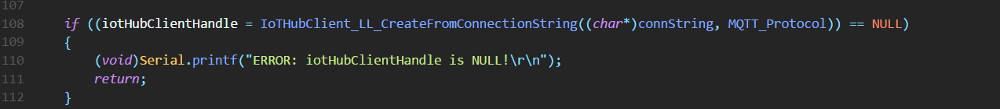
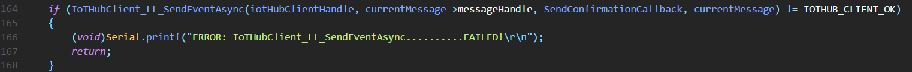
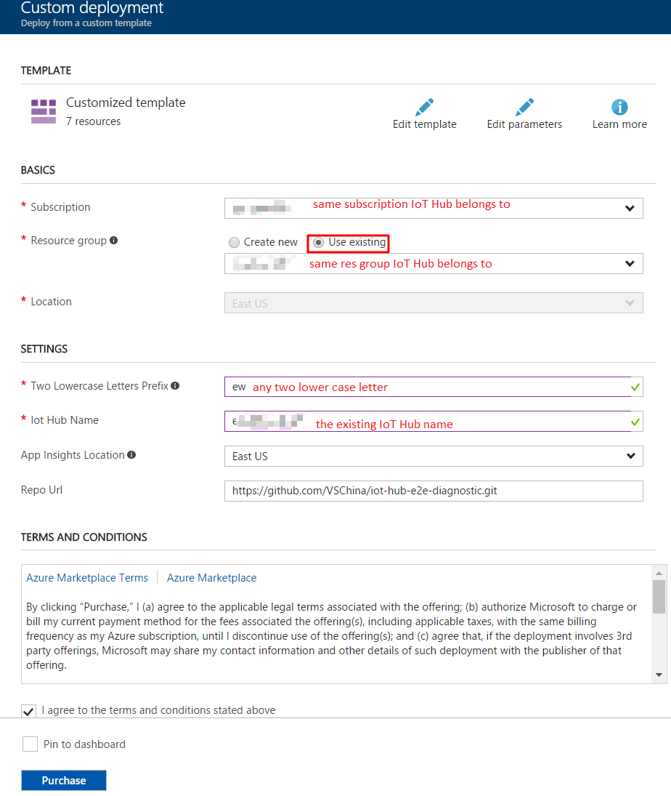
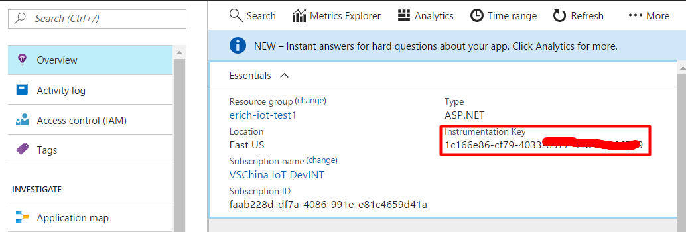
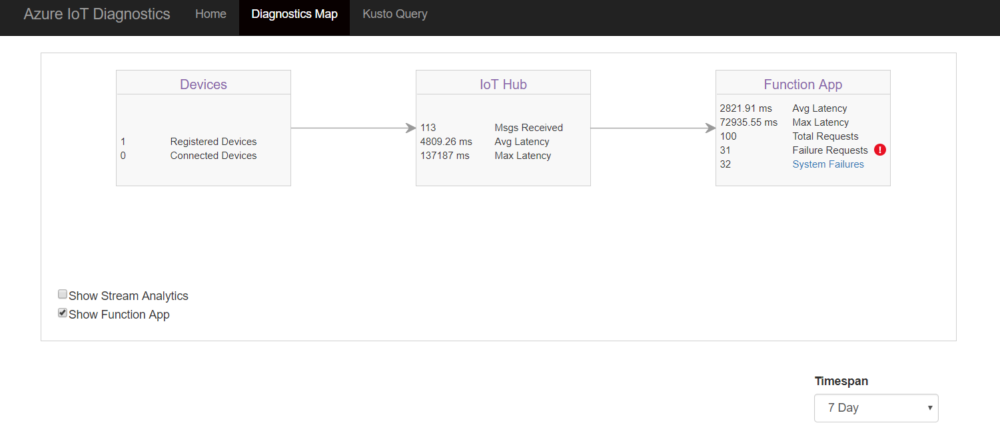

# Setup E2E Diagnostics Solution for Shake Shake Project

## Prerequisite
1. We suppose that you have already setup **Shake Shake Project**, if not, please refer [Shake Shake Project](https://microsoft.github.io/azure-iot-developer-kit/docs/projects/shake-shake/).

## Step 1: Update Code for Devkit

1. Open **_iothub_client_sample_mqtt.cpp** in Shake Shake Project


2. We need to update code in 2 places:

   **Near the line 100**
   - - -
   

   Replace

   ```
   IoTHubClient_LL_CreateFromConnectionString((char*)connString, MQTT_Protocol))
   ```

   to

   ```
   IoTHubClient_LL_CreateFromConnectionString_WithDiagnostics(SAMPLING_CLIENT, 100, (char*)connString, MQTT_Protocol))
   ```

   **Near the line 150**
   - - -
   

   Replace

   ```
   IoTHubClient_LL_SendEventAsync
   ```

   to

   ```
   IoTHubClient_LL_SendEventAsync_WithDiagnostics
   ```


3. Build and upload the code using "task device-upload", your can refer [Shake Shake Project Step 5](https://microsoft.github.io/azure-iot-developer-kit/docs/projects/shake-shake/)


## Step 2: Setup E2E Diagnostic solution for Shake Shake Project

### Provision diagnostics resources using ARM template
1. Navigate to [e2e diagnostics repo](https://github.com/VSChina/iot-hub-e2e-diagnostic/tree/existing_HUB_AF)
2. Click **Deploy to Azure**, it will navigate to azure portal
3. Select subscription and resource group that Shake Shake Project belongs to

   

4. Two lower case letters prefix is used as prefix of provisioned resources for distinguishing from other resources
5. Check "*I agree to terms and conditions stated above*"
6. Click **Purchase**

### Modifying existing IoT Hub
1. Please refer to [Modify Existing IoT Hub](./Modify%20Existing%20IoT%20Hub.md)

### Modifying existing Azure Function
1. Open your Azure portal, and go to Application Insights that created in step 2. Keep a record of Instrumentation Key shown in the picture below: 


2. Open Azure Function -> Shake Shake Project Azure Function
3. Update the code in the Azure function

   ```js
   'use strict';
   // This function is triggered each time a message is revieved in the IoTHub.
   // The message payload is persisted in an Azure Storage Table
   const Message = require('azure-iot-common').Message;
   const iotHubConnectionString = process.env['iotHubConnectionString'];
   const cloudClient = require('azure-iothub').Client.fromConnectionString(iotHubConnectionString);
   const request = require('request');
   
   function truncateByDot(text, limit){
       return text.length < limit ? text : text.substr(0, limit - 3) + '...';
   }
   
   function completeContextWithError(context, errorMessage){
       context.done('ShakeShakeAzureFuncError: ' + errorMessage);
   }
   
   module.exports = function (context, myEventHubMessage) {
       // The right way to retrieve the device id is to get it from Azure Function proerpy bag
       // But seems the property bag cannot be stably retrieved from Azure so we choose to hard code the device id here for stability.
       /*
       if (!context.bindingData || !context.bindingData.systemProperties || !context.bindingData.systemProperties['iothub-connection-device-id']) {
           context.log('no device id');
           context.done();
           return;
       }
       var deviceId = context.bindingData.systemProperties['iothub-connection-device-id'];
       */
   
       var deviceId = "AZ3166";
       if (deviceId && myEventHubMessage.topic) {
           cloudClient.open(function (err) {
               if (err) {
                   completeContextWithError(context, `could not connect: ${err.message}`);
               } else {
                   context.log('Client connected');
                   let tweet = '';
                   // TODO: 
                   // Please replace this test Twitter bearer token with you own.
                   // To apply for your own Twitter bearer token, go to https://dev.twitter.com/ and register a new Twitter app to get Consumer Key and Secret
                   // Then generate the token using utility like this: https://gearside.com/nebula/utilities/twitter-bearer-token-generator/ 
                   let options = {
                       url: 'https://api.twitter.com/1.1/search/tweets.json?count=3&q=%23' + myEventHubMessage.topic,
                       headers: {
                           'Authorization': 'Bearer ' + 'AAAAAAAAAAAAAAAAAAAAAGVU0AAAAAAAucpxA9aXc2TO6rNMnTcVit1P3YM%3DrQpyFeQ6LOwyvy7cqW5djhLPnFfjEK8H3hA1qfGDh93JRbI1le'
                       }
                   };
                   request(options, (error, response, body) => {
                       if (!error && response.statusCode == 200) {
                           let info = JSON.parse(body);
                           tweet = (info.statuses && info.statuses.length) ? `@${truncateByDot(info.statuses[0].user.name, 13)}:\n${info.statuses[0].text}` : "No new tweet.";
                           context.log(tweet);
                           const message = new Message(tweet);
                           cloudClient.send(deviceId, message, function (err, res) {
                               cloudClient.close();
                               if (err) {
                                   completeContextWithError(context, `error in send C2D message: ${err}`);
                               } else {
                                   context.log(`send status: ${res.constructor.name}`);
                                   context.done();
                               }
                           });
                       }
                       else {
                           cloudClient.close();
                           completeContextWithError(context, `fail to call twitter API: ${error}`);
                       }
                   });
               }
           });
       }
       else{
           context.log(myEventHubMessage);
           completeContextWithError(context, `topic must not be null or empty in message ${myEventHubMessage}`);
       }
   };
   ```


4. Open Application settings of the Azure function, and add App settings:

   |         App Settings Key         |                 App Settings Vaule                  |
   |----------------------------------|-----------------------------------------------------|
   | APPINSIGHTS_INSTRUMENTATIONKEY   |                Instrumentation Key                  |


### Configure Web App
1. Please refer the document [Configure Application Insights Keys in Web App](./Guide%20to%20Config%20Application%20Insights%20Keys%20in%20Web%20App.md)


## Step 3: Test the project
1. After app initialization, click button A and mildly shake the board to retrieve a random tweet with your hashtag (e.g. #build2017). A tweet will display on your screen in a few seconds

2. Go to the Web APP deployed by Step 2, check if the diagnostic messages shown on the portal:


