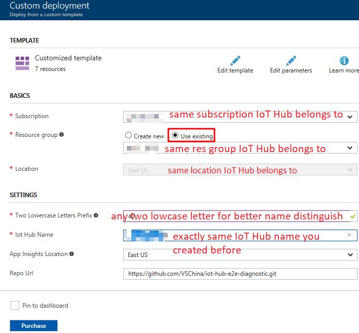

# Enable E2E Diagnostics in a Full-Stack IoT Hub Solution

This tutorial will demonstrate how to enable end-to-end diagnostics in a full-stack IoT Hub solution.

In this tutorial, you will learn:
* IoT Hub solution architecture
* How to setup E2E diagnostics based on your existing IoT solution
* How to verify E2E diagnostics works

## Prerequisite
We suppose you have Azure account already, if not, please first [create an azure account](https://azure.microsoft.com/en-us/free/).

## Full-Stack IoT Hub Solution Architecture
The following figure gives one typical IoT Hub solution architecture:

   
To enable end-to-end diagnostics in the above IoT Hub solution, a few resources need to be provisioned. The following figure demonstrates new solution architecture with end-to-end diagnostics support:

   

## Setup E2E Diagnostics Solution With Existing IoT Hub
### Provision diagnostics resources using ARM template
1. Navigate to [E2E Diagnostics Repo](https://github.com/VSChina/iot-hub-e2e-diagnostic/tree/existing_HUB)
2. Click **Deploy to Azure**
3. Use the same subscription, resource group and location that your existing IoT Hub belongs to

   
4. Use two lower case letters as prefix for provisioned resources to distinguish them from other resources
5. Check "*I agree to terms and conditions stated above*"
6. Click **Purchase**

### Modify Existing IoT Hub
Please refer to [Modify Existing IoT Hub](./Modify%20Existing%20IoT%20Hub.md)

### Configure Web App
Please refer the document [Configure Application Insights Keys in Web App](./Guide%20to%20Config%20Application%20Insights%20Keys%20in%20Web%20APP.md)


### Start Stream Analytics Job
Among all resources deployed by ARM template, there is one Stream Analytics job resource starting with *two letters prefix*+**stream**. Open this resource and navigate to its Overview tab, click start button to start the streaming job.

## Verify E2E Diagnostics
After setting up E2E diagnostics, there are several steps to do to verify if it works as expected.

### Create At Least One Device In IoT Hub
1. Navigate to your IoT Hub in Azure portal
2. Click “Device Explorer” tab, then click “Add” button to add one device
3. Click the device you just created to copy **Device Connection String** which we’ll use later

 

### Send D2C Messages Using E2E Diagnostics Layered Azure IoT SDKs
Please follow [How to use E2E diagnostics Layered SDK on Raspberry Pi](https://github.com/erich-wang/azure-iot-sdk-c/tree/erich-e2e-0630/iothub_client_diag_wrapper) to run samples on Raspberry Pi. For example:
```
./iothub_client_diag_wrapper_sample_server <Device Connection String>
```

### Open Dashboard
Among all resources deployed by ARM template, there is one App Service resource starting with **webapp**, find the App Service first, then navigate to its Overview tab, make a note of the **URL** value which is called Dashboard.

   
Open the dashboard, switch to "Diagnostics Map", the number of messages should be 0.

### Update Device Sampling Rate
1. Stay in the page, navigate back to **Home**
2. Set 'Status' ON and 'Sample' value between 0-100

   
3. 'Device List' is optional, leave it blank to update all devices, or set the value 'device1,device2,device3' in this format to update certain devices

### Check Dashboard
Check "Diagnostics Map" in Dashboard, connected device value should be 1. Wait for 5~10 minutes because of delay in AI, the value of "Msgs Received/Msg Processed/Avg Latency/Max Latency" should be changed to some value other than original 0; Failures should be 0 always.

### Failed Messages Percentage
**Failed messages** is a business logic concept, for example, we could treat a message as invalid if it misses the required fields or the field value is not as expected.

Please use CTRL+C to stop iothub_client_diag_wrapper_sample_server, then run follow command to simulate invalid messages
```
./iothub_client_diag_wrapper_sample_server <Device Connection String> "yes"
```

In our sample solution, we treat a message as invalid if 'temperature' field is missing. You could re-define the Azure Function per your business need, then send some invalid messages as sample, finally(maybe 5~10 minutes delay) you should notice that the number of "Failures" in Dashboard becomes > 0.
