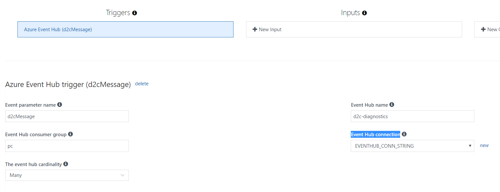

# How to Update Existing Azure Functions

This tutorial explains how to update existing Azure Functions for sending diagnostic data to AI.

## Prerequisites
1. Your Azure IoT Hub has already been setup 
2. You Have already setup Application Insights
3. Your existing Azure Functions consume data from Azure IoT Hub 

If your current environment doesn't meet the prerequisite, you can refer to ["How to create IoT Hub end to end diagnostic from scratch"](https://github.com/VSChina/iot-hub-e2e-diagnostic/tree/tutorial)

## Update Existing Azure Functions

1. Open your Azure portal, and go to Application Insights. Keep a record of Instrumentation Key shown in the picture below:


2. Get Event Hub connection string from Azure Portal: Event Hub -> Shared Access Policies -> RootManageSharedAccessKey


3. Open Azure Function -> Your Azure Function -> Application settings, add App settings:


| APP_INSIGHTS_INSTRUMENTATION_KEY | Application Insights Key obtained from step 1   |
|----------------------------------|-----------------------------------------------------|
| EVENTHUB_CONN_STRING             | Event Hub Connection String Obtained from set 2 |


4. Config your Azure Function Triggers to Azure Event Hub, and the Event Hub connection is EVENTHUB_CONN_STRING




5. Insert code to send Telemetry to Application Insights

#### C# Code
```cs
    TelemetryClient telemetry = new TelemetryClient();
    telemetry.InstrumentationKey = System.Environment.GetEnvironmentVariable("APP_INSIGHTS_INSTRUMENTATION_KEY");

    Dictionary<string,string> diagnostics = new Dictionary<string,string>();
    foreach(KeyValuePair<string, object> entry in d2cMessage.Properties) {
        if (entry.Key.StartsWith("x-"))
        {
            diagnostics.Add(entry.Key, (string)entry.Value);
        }
    }

    if (diagnostics.Count > 0)
    {
        telemetry.TrackEvent("d2c-diagnostics", diagnostics);
    }
```


#### JS Code

```js
var AppInsights = require('applicationinsights');
var aiClient = AppInsights.getClient(process.env.APP_INSIGHTS_INSTRUMENTATION_KEY);
aiClient.trackEvent('d2c-diagnostics', diagnosticEvent);
```