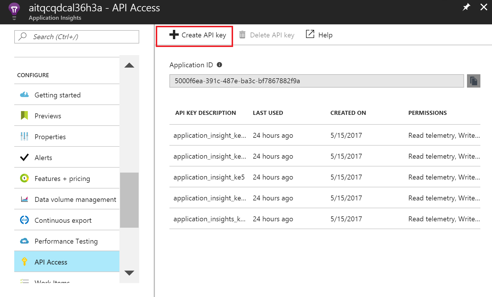
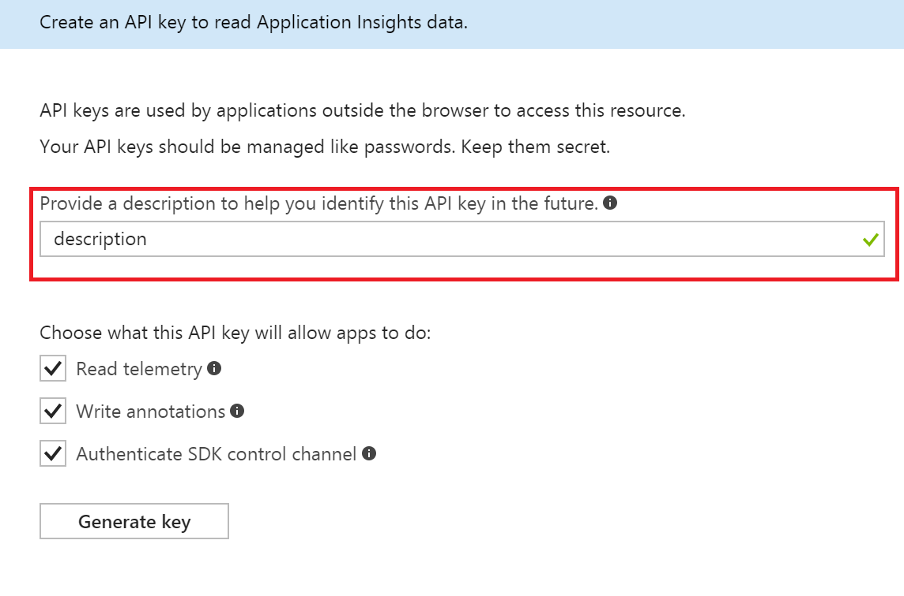
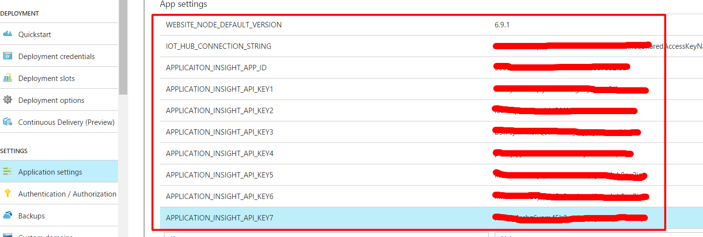

## Setup E2E Diagnostic solution based on existing IoT Hub and Stream Analytics
### Provision diagnostics resources using ARM template
1. Navigate to [e2e diagnostics repo](https://github.com/VSChina/iot-hub-e2e-diagnostic/tree/existing_HUB_SA)
2. Click **Deploy to Auzre**, it will navigate to azure portal
3. Select subscription and resource group that existing IoT Hub and Stream Analytics belongs to

4. Two lower case letters prefix is used as prefix of provisioned resources for distinguishing from other resources
5. Check "*I agree to terms and conditions stated above*"
6. Click **Purchase**

### Modifying existing IoT Hub
1. Open the existing IoT Hub in Azure portal
2. Navigate to **Endpoints** under **MESSAGING**, click **Add** button to add end point

3. Navigate to **Routes** under **MESSAGING**, click **Add** button to add two routes:


### Modifying existing Stream Analytics Job
1. Open the existing Stream Analytics Job in Azure portal, make sure use portal [https://portal.azure.com/?feature.customportal=false](https://portal.azure.com/?feature.customportal=false) to workaround a known Azure issue
2. Click **Overview** tab and click *Stop* button to stop streaming job
3. Click **Outputs** tab under *JOB TOPOLOGY*
4. Click *Add* button to add new output, then click *Create* button

   
5. Click **Query** tab under *JOB TOPOLOGY*, append the following query at the end of existing query, of course you need replace *Input* and *diagOutput* with corresponding input and output in your query:
    ```sql
    SELECT
        *, GetMetadataPropertyValue([Input], '[User].[x-correlation-id]') AS 'x-correlation-id',
        GetMetadataPropertyValue([Input], '[User].[x-before-send-request]') AS 'x-before-send-request'
    INTO
        [diagOutput]
    FROM
        [Input]
    WHERE 
        GetMetadataPropertyValue([Input], '[User].[x-correlation-id]') IS NOT NULL
    ```
6. Click *Save* button to save the change
7. Switch to **Overview** tab, click *Start* button to start streaming job

### Configure Web App
In order to track the behaviors of Web APP correctly with Application Insights, there are some required settings need to be configured manually.

First of all, *Application ID* of the Application Insights must be set in the Web APP. Besides, there are several API Keys the Web APP need to use.

1. Get the Application ID

    Find the Application Insights deployed by the ARM Template, click **API Access** in the left panel under **CONFIGURE**, the *Application ID* just shows in right panel.

    Copy it and we will use it later.

    

2. Create Application Insights API Keys

    Stay in the **API Access** panel, click the **Create API Key** button:

    

    Provide a description in the pop up panel to help you identify this API Key in the future.
    Check all permission that the API Key will allow apps to do.

    Then click **Generate key**.

    **Make sure you copy the key immediately.** You won't see it again once you close the panel.

    Repeat the actions several times depending on the number of keys requried (We need 8 API Key for our scenario). And please make sure you copy the API Key immediately after it is generated.

    

3. Config the API Key in Web APP

    Go to the Web APP that will leverage the Application Insights, click the **Application settings** in the left panel, scroll down to App Settings.
    Fill in the rows whose keys were already set by ARM Template with corresponding values, including the Application ID we just copied and the API Keys created.

    Click the **Save** button in the left top to save all the settings.

    
