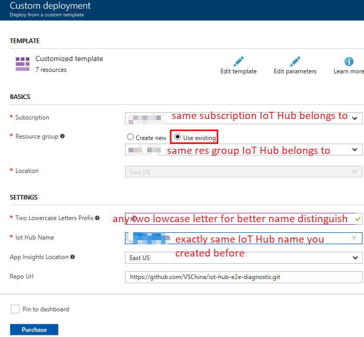
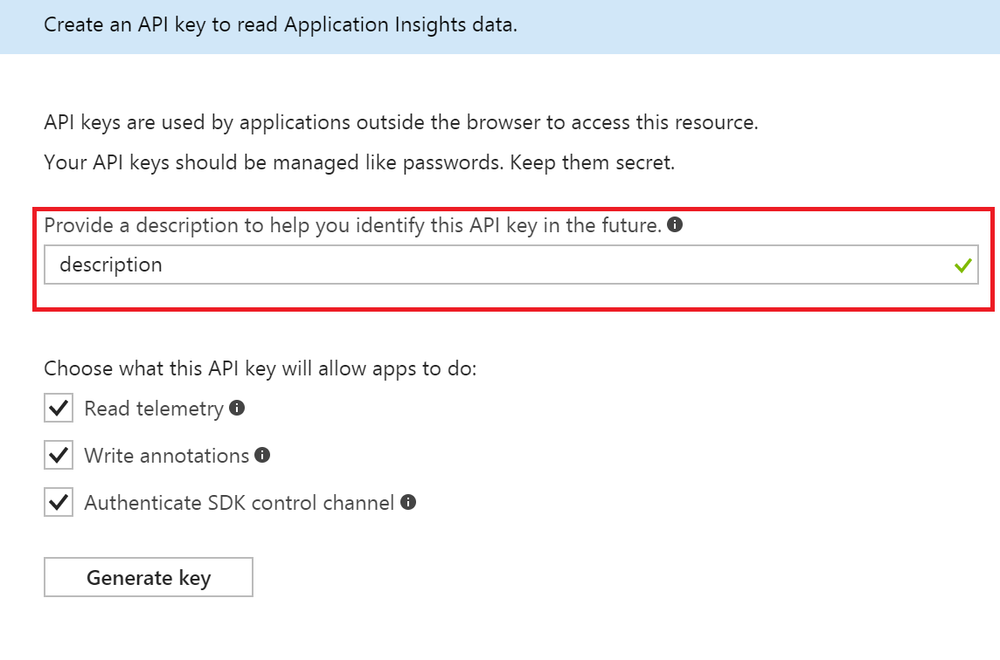

# Enable E2E Diagnostic in a Full-Stack IoT Hub Solution
This tutorial will desmonstrate how to enable end-to-end diagnostic in a full-stack IoT Hub solution.

In this tutorial, you will learn:
* IoT Hub solution architecture
* Setup brand new IoT Hub solution with end-to-end diagnostics
* Setup IoT Hub solution based on existing IoT Hub and Stream Analytics

## Prerequisite
We suppose you had Azure account already, if not, please first [create Azure account](https://azure.microsoft.com/en-us/free/).

## Full-stack IoT Hub solution architecture
The following figure gives one typical IoT Hub solution architecture:

To enable end-to-end diagnostics in the above IoT Hub solution, a few resources should be provisioned. The following figure demonstrates new solution architecture with end-to-end diagnostics support:


## Setup brand new IoT Hub solution with e2e diagnostics
1. Navigate to [brand new IoT Hub solution branch](https://github.com/VSChina/iot-hub-e2e-diagnostic/tree/netnew_armtemplate)
2. Click **Deploy to Azure**
3. Select subscription and provide necessary settings
4. Check "*I agree to terms and conditions stated above*"
5. Click **Purchase**
6. After deploying success, update API Key for Web APP. Please refer: ["Guide to Config Application Insights Keys in Web APP"](https://github.com/VSChina/iot-hub-e2e-diagnostic/tree/tutorial)

## Setup IoT Hub solution based on existing IoT Hub and Stream Analytics
### Provision diagnostics resources using ARM template
1. Navigate to [e2e diagnostics repo](https://github.com/VSChina/iot-hub-e2e-diagnostic/tree/existing_HUB_SA)
2. Click **Deploy to Auzre**, it will navigate to azure portal
3. Select subscription and resource group that existing IoT Hub and Stream Analytics belongs to

4. Two lower case letters prefix is used as prefix of provisioned resources for distinguishing from other resources
5. Check "*I agree to terms and conditions stated above*"
6. Click **Purchase**

### Modifying existing IoT Hub
1. Open the existing IoT Hub in Azure portal
2. Navigate to **Endpoints** under **MESSAGING**, click **Add** button to add end point

3. Navigate to **Routes** under **MESSAGING**, click **Add** button to add two routes:


### Modifying existing Stream Analytics Job
1. Open the existing Stream Analytics Job in Azure portal
2. Click **Overview** tab and click *Stop* button to stop streaming job
3. Click **Outputs** tab under *JOB TOPOLOGY*
4. Click *Add* button to add new output, then click *Create* button

   
5. Click **Query** tab under *JOB TOPOLOGY*, append the following query at the end of existing query, of course you need replace *diagInput* and *diagOutput* with corresponding input and output in your query:
    ```sql
    SELECT
        *, GetMetadataPropertyValue([diagInput], '[User].[x-correlation-id]') AS 'x-correlation-id',
        GetMetadataPropertyValue([diagInput], '[User].[x-before-send-request]') AS 'x-before-send-request'
    INTO
        [diagOutput]
    FROM
        [diagInput]
    WHERE 
        GetMetadataPropertyValue([diagInput], '[User].[x-correlation-id]') IS NOT NULL
    ```
6. Click *Save* button to save the change
7. Switch to **Overview** tab, click *Start* button to start streaming job

### Configure Web App
In order to track the behaviors of Web APP correctly with Application Insights, there are some required settings need to be configured manually.

First of all, *Application ID* of the Application Insights must be set in the Web APP. Besides, there are several API Keys the Web APP need to use.

1. Get the Application ID

    Find the Application Insights deployed by the ARM Template, click **API Access** in the left panel under **CONFIGURE**, the *Application ID* just shows in right panel.

    Copy it and we will use it later.

    

2. Create Application Insights API Keys

    Stay in the **API Access** panel, click the **Create API Key** button:

    

    Provide a description in the pop up panel to help you identify this API Key in the future.
    Check all permission that the API Key will allow apps to do.

    Then click **Generate key**.

    **Make sure you copy the key immediately.** You won't see it again once you close the panel.

    Repeat the actions several times depending on the number of keys requried (We need 8 API Key for our scenario). And please make sure you copy the API Key immediately after it is generated.

    

3. Config the API Key in Web APP

    Go to the Web APP that will leverage the Application Insights, click the **Application settings** in the left panel, scroll down to App Settings.
    Fill in the rows whose keys were already set by ARM Template with corresponding values, including the Application ID we just copied and the API Keys created.

    Click the **Save** button in the left top to save all the settings.

    
