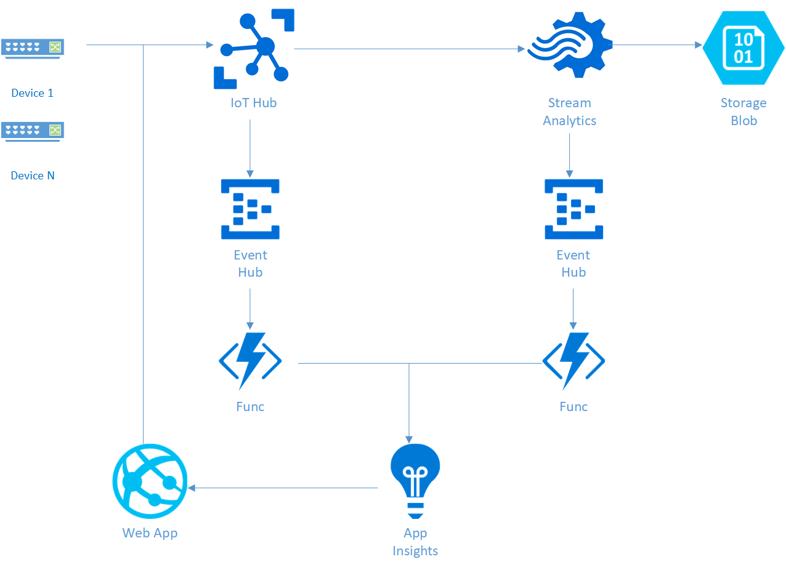
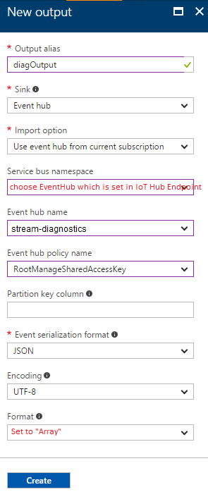

# Enable E2E Diagnostic in a Full-Stack IoT Hub Solution
This tutorial will desmonstrate how to enable end-to-end diagnostic in a full-stack IoT Hub solution.

In this tutorial, you will learn:
* IoT Hub solution architecture
* Setup brand new IoT Hub solution with end-to-end diagnostics
* Setup IoT Hub solution based on existing IoT Hub and Stream Analytics

## Prerequisite
We suppose you had Azure account already, if not, please first [create Azure account](https://azure.microsoft.com/en-us/free/).

## Full-stack IoT Hub solution architecture
The following figure gives one typical IoT Hub solution architecture:

To enable end-to-end diagnostics in the above IoT Hub solution, a few resources should be provisioned. The following figure demonstrates new solution architecture with end-to-end diagnostics support:


## Setup brand new IoT Hub solution with e2e diagnostics
1. Navigate to [brand new IoT Hub solution branch](https://github.com/VSChina/iot-hub-e2e-diagnostic/tree/netnew_armtemplate)
2. Click **Deploy to Azure**
3. [TODO Update AI API Key]

## Setup IoT Hub solution based on existing IoT Hub and Stream Analytics
### Provision diagnostics resources using ARM template
1. Navigate to [e2e diagnostics repo](https://github.com/VSChina/iot-hub-e2e-diagnostic/tree/existing_HUB_SA)
2. Click **Deploy to Auzre**, it will navigate to azure portal
3. Select subscription and resource group that existing IoT Hub and Stream Analytics belongs to

4. Two lower case letters prefix is used as prefix of provisioned resources for distinguishing from other resources
5. Select the checkbox "*I agree to terms and conditions stated above*"
6. Click **Purchase**

### Modifying existing IoT Hub
1. Open the existing IoT Hub in Azure portal
2. Navigate to **Endpoints** under **MESSAGING**, click **Add** button to add end point

3. Navigate to **Routes** under **MESSAGING**, click **Add** button to add two routes:


### Modifying existing Stream Analytics
1. Open the existing Stream Analytics in Azure portal
2. Click **Overview** tab and click *Stop* button to stop streaming job
3. Click **Outputs** tab under *JOB TOPOLOGY*
4. Click *Add* button to add new output, then click *Create* button

   
5. Click **Query** tab under *JOB TOPOLOGY*, append the following query at the end of existing query, of course you need replace *erichiot2* and *diagOutput* with corresponding input and output in your query:
```sql
SELECT
    *, GetMetadataPropertyValue([erichiot2], '[User].[x-correlation-id]') AS 'x-correlation-id',
    GetMetadataPropertyValue([erichiot2], '[User].[x-before-send-request]') AS 'x-before-send-request'
INTO
    [diagOutput]
FROM
    [erichiot2]
WHERE 
    [x-correlation-id] IS NOT NULL
```
6. Click *Save* button to save the change
7. Switch to **Overview** tab, click *Start* button to start streaming job