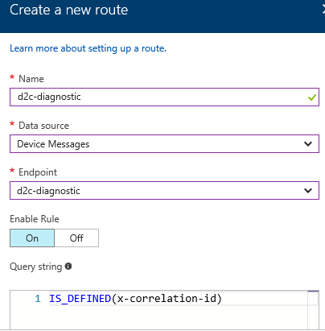

# Setup E2E Diagnostic solution based on existing IoT Hub and Stream Analytics
## Provision diagnostics resources using ARM template
1. Navigate to [e2e diagnostics repo](https://github.com/VSChina/iot-hub-e2e-diagnostic/tree/existing_HUB_SA)
2. Click **Deploy to Auzre**, it will navigate to azure portal
3. Select subscription and resource group that existing IoT Hub and Stream Analytics belongs to

4. Two lower case letters prefix is used as prefix of provisioned resources for distinguishing from other resources
5. Check "*I agree to terms and conditions stated above*"
6. Click **Purchase**

## Modifying existing IoT Hub
1. Open the existing IoT Hub in Azure portal
2. Navigate to **Endpoints** under **MESSAGING**, click **Add** button to add end point

3. Navigate to **Routes** under **MESSAGING**, click **Add** button to add two routes:



## Modifying existing Stream Analytics Job
1. Open the existing Stream Analytics Job in Azure portal, make sure use portal [https://portal.azure.com/?feature.customportal=false](https://portal.azure.com/?feature.customportal=false) to workaround a known Azure issue
2. Click **Overview** tab and click *Stop* button to stop streaming job
3. Click **Outputs** tab under *JOB TOPOLOGY*
4. Click *Add* button to add new output, then click *Create* button

   
5. Click **Query** tab under *JOB TOPOLOGY*, append the following query at the end of existing query, of course you need replace *Input* and *diagOutput* with corresponding input and output in your query:
    ```sql
    SELECT
        *, GetMetadataPropertyValue([Input], '[User].[x-correlation-id]') AS 'x-correlation-id',
        System.Timestamp AS 'processed-utc-time'
    INTO
        [diagOutput]
    FROM
        [Input]
    WHERE 
        GetMetadataPropertyValue([Input], '[User].[x-correlation-id]') IS NOT NULL
    ```
6. Click *Save* button to save the change
7. Switch to **Overview** tab, click *Start* button to start streaming job

## Configure Web App
Please refer the document [Guide to Update Existing IoT Hub and SAS.](./Guide%20to%20Config%20Application%20Insights%20Keys%20in%20Web%20APP.md)
