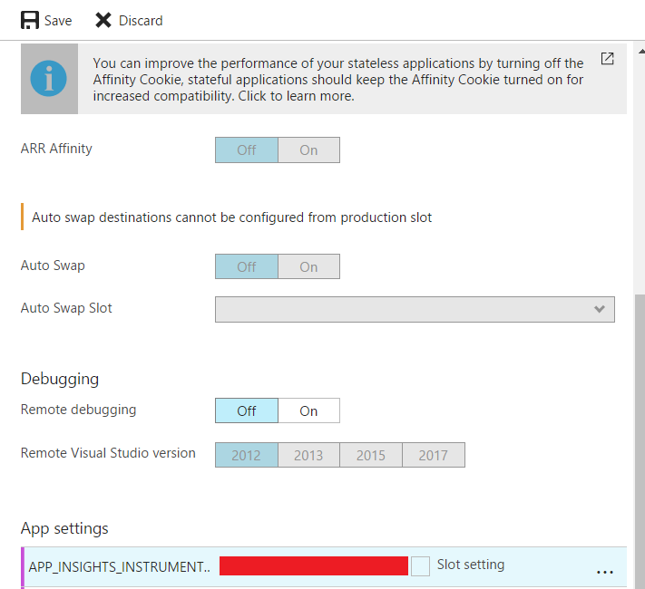

# How to Update Existing Azure Functions

This tutorial explains how to update existing Azure Functions for sending diagnostic data to AI.

## Prerequisites
1. Your Azure IoT Hub has already been setup 
2. You Have already setup Application Insights
3. Your Azure function is consuming data from IoT Hub or Stream Analytics

If your current environment doesn't meet the prerequisites, you can refer these documents before starting this tutorial: ["Enable E2E Diagnostics in a Full-Stack IoT Hub Solution"](https://github.com/VSChina/iot-hub-e2e-diagnostic/tree/tutorial)

## Update Existing Azure Functions

1. Open your Azure portal, and go to Application Insights. Keep a record of Instrumentation Key shown in the picture below:


2. Open Azure Function -> Your Azure Function -> Application settings, add App settings:

|         App Settings Key         |                 App Settings Vaule                  |
|----------------------------------|-----------------------------------------------------|
| APP_INSIGHTS_INSTRUMENTATION_KEY | Instrumentation Key obtained from step 1   |



3. Insert code to send Telemetry to Application Insights

#### Send Azure Function latency to AI
```cs
public static void Run(EventData myEventHubMessage, TraceWriter log)
{
    // Your business code here

    DateTime processedTime = DateTime.UtcNow;
    TelemetryClient telemetry = new TelemetryClient();
    telemetry.InstrumentationKey = System.Environment.GetEnvironmentVariable("APP_INSIGHTS_INSTRUMENTATION_KEY");

    const string enqueueTimeKey = "EnqueuedTime";
    const string processedTimeKey = "processed-utc-time";
    const string correlationIdKey = "x-correlation-id";
    const string iotHubKey = "IoTHub";

    bool validMessage = false;
    var message = Encoding.UTF8.GetString(myEventHubMessage.GetBytes());
    var serializer = new JavaScriptSerializer();
    var properties = serializer.Deserialize<Dictionary<string, object>>(message);

    DateTime enqueueTime;
    if (properties.ContainsKey(correlationIdKey) &&
        properties.ContainsKey(iotHubKey) &&
        properties.ContainsKey("temperature"))
    {
        var iotProperties = properties[iotHubKey] as Dictionary<string, object>;
        if (iotProperties.ContainsKey(enqueueTimeKey) &&
            DateTime.TryParse(iotProperties[enqueueTimeKey].ToString(), out enqueueTime))
        {
            var latencyInMilliseconds = (processedTime - enqueueTime).TotalMilliseconds;
            log.Info(iotProperties[enqueueTimeKey].ToString());
            log.Info(properties[processedTimeKey].ToString());
            latencyInMilliseconds = Math.Max(0, latencyInMilliseconds);
            var customeProperties = new Dictionary<string, string>()
                        {
                            {correlationIdKey, properties[correlationIdKey].ToString()},
                            {enqueueTimeKey, iotProperties[enqueueTimeKey].ToString()},
                            {processedTimeKey, properties[processedTimeKey].ToString()}
                        };

            telemetry.TrackMetric("StreamJobLatency", latencyInMilliseconds, customeProperties);

            validMessage = true;
        }
    }
    if (!validMessage)
    {
        var customProperties = new Dictionary<string, string>();
        foreach (var keyValue in properties)
        {
            if (keyValue.Key == iotHubKey || keyValue.Key == "User")
            {
                var iotProperties = keyValue.Value as Dictionary<string, object>;
                foreach (var iotKV in iotProperties)
                {
                    customProperties[keyValue.Key + "." + iotKV.Key] = iotKV.Value == null ? "null" : iotKV.Value.ToString();
                }
            }
            else
            {
                customProperties[keyValue.Key] = keyValue.Value.ToString();
            }
        }
        customProperties["DiagnosticErrorMessage"] = "Fail to read temperature sensor data";
        telemetry.TrackMetric("StreamInvalidMessage", 1, customProperties);
    }
```