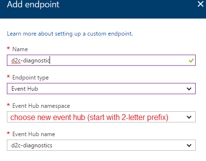
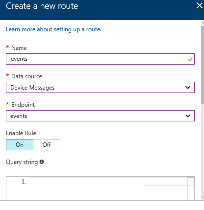
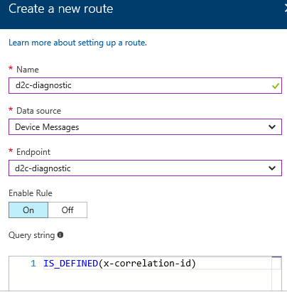

# Modifying existing IoT Hub
1. Open the existing IoT Hub in Azure portal
2. Navigate to **Endpoints** under **MESSAGING**, click **Add** button to add end point

3. Navigate to **Routes** under **MESSAGING**, click **Add** button to add two routes:

