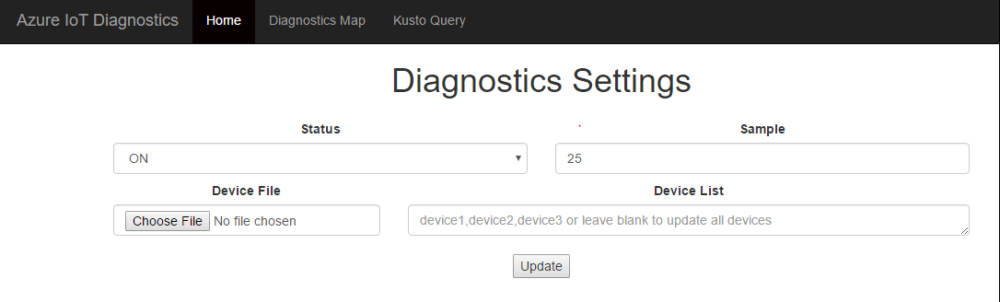

# Enable E2E Diagnostics in a Full-Stack IoT Hub Solution

This tutorial will desmonstrate how to enable end-to-end diagnostic in a full-stack IoT Hub solution.

In this tutorial, you will learn:
* IoT Hub solution architecture
* Setup brand new IoT Hub solution with end-to-end diagnostics
* Setup IoT Hub solution based on existing IoT Hub and Stream Analytics

## Prerequisite
We suppose you had Azure account already, if not, please first [create Azure account](https://azure.microsoft.com/en-us/free/).

## Full-stack IoT Hub solution architecture
The following figure gives one typical IoT Hub solution architecture:

To enable end-to-end diagnostics in the above IoT Hub solution, a few resources should be provisioned. The following figure demonstrates new solution architecture with end-to-end diagnostics support:

## Setup brand new IoT Hub solution with E2E diagnostics
1. Navigate to [brand new IoT Hub solution branch](https://github.com/VSChina/iot-hub-e2e-diagnostic/tree/netnew_armtemplate)
2. Click **Deploy to Azure**
3. Select subscription and provide necessary settings
4. Check "*I agree to terms and conditions stated above*"
5. Click **Purchase**
6. After deploying success, update API Key for Web APP. Please refer: ["Guide to Config Application Insights Keys in Web APP"](,/Guide%20to%20Config%20Application%20Insights%20Keys%20in%20Web%20APP.md)

## Setup E2E diagnostics based on existing IoT Hub and Stream Analytics
Please refer the document [Guide to Update Existing IoT Hub and SAS.](./Guide%20to%20Update%20Existing%20IoT%20Hub%20and%20SAS.md)

## Verify E2E diagnostics

### Create at least one device in the IoT Hub

### Send D2C messages using E2E diagnostics layered Azure IoT SDKs
There're three available layered SDKs, you may choose any of them for sending D2C messages:
- [Azure IoT E2E Diagnostics Layered SDK for .NET](https://github.com/VSChina/azure-iot-diagnostics-csharp)
- [Azure IoT E2E Diagnostics Layered SDK for C](https://github.com/erich-wang/azure-iot-sdk-c)
- [Azure IoT E2E Diagnostics Layered SDK for JAVA](https://github.com/VSChina/azure-iot-diagnostics-java)

Please make sure server sampling rate configuration is used choose when initializing device client class, e.g. SamplingRateSource.Server in C#.

### Check Dashboard
Among all resources deployed by ARM template, there's one App Service resource starting with **webapp**, find the App Service first, then navigate to its Overview tab, write down the **URL** value which is called **Dashboard**.

Open the Dashboard, switch to "Diagnostics Map", the number of messages should be 0.

### Update Device Sampling Rate
1. Open **Dashboard**
2. Set 'Status' as ON, 'Sample' as value between 0-100

3. For 'Device List', it is optional, leave blank to update all devices, or use 'device1,device2,device3' format to update certain devices

### Check Dashboard
Wait around 3~5 mins, Connected device should be 1, the number of messages processed should not be 0, the failed messages percentage should be 0

### Failed Messages Percentage in ASA
Failed messages is business logic related concept, for example, we may define one message as failed one if there's no required fields or one field value is considered as invalid. In our sample solution, we define one message as invalid if missing 'temperature' field in the message. You need to refine the Azure Function per your business need. 
