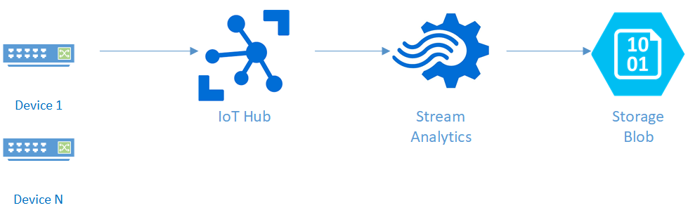
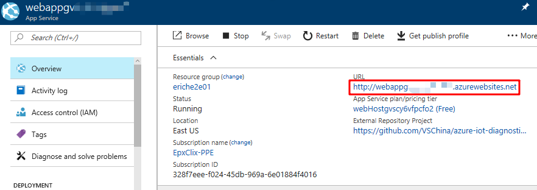

# Enable E2E Diagnostics in a Full-Stack IoT Hub Solution

This tutorial will demonstrate how to enable end-to-end diagnostics in a full-stack IoT Hub solution.

In this tutorial, you will learn:
* IoT Hub solution architecture
* Setup E2E diagnostics based on your existing IoT solution
* Verify E2E diagnostics

## Prerequisite
We suppose you had Azure account already, if not, please first [create Azure account](https://azure.microsoft.com/en-us/free/).

## Full-stack IoT Hub solution architecture
The following figure gives one typical IoT Hub solution architecture:

To enable end-to-end diagnostics in the above IoT Hub solution, a few resources should be provisioned. The following figure demonstrates new solution architecture with end-to-end diagnostics support:


## Provision necessary resources to support E2E Diagnostics
Based on your current IoT solution, you may follow any of following steps to setup E2E diagnostics:
- [Setup E2E Diagnostics solution from scratch](./Guide%20to%20Setup%20E2E%20Diagnostics%20Solution%20from%20Scratch.md)
- [Setup E2E Diagnostics solution with existing IoT Hub and Stream Analytics](./Guide%20to%20Setup%20E2E%20Diagnostics%20Solution%20With%20Existing%20IoT%20Hub%20and%20Stream%20Analytics.md)
- [Setup E2E Diagnostics solution with existing IoT Hub and Function App](./Guide%20to%20Setup%20E2E%20Diagnostics%20Solution%20with%20Existing%20IoT%20Hub%20and%20Function%20App.md)
- [Setup E2E Diagnostics Solution with existing Application Insights](./Guide%20to%20Setup%20E2E%20Diagnostics%20Solution%20With%20Existing%20Application%20Insights.md)

## Verify E2E diagnostics

After setting up E2E diagnostics, you need to verify whether it works as expected.

### Create at least one device in the IoT Hub

### Send D2C messages using E2E diagnostics layered Azure IoT SDKs
There're three available layered SDKs, you may choose any of them for sending D2C messages:
- [Azure IoT E2E Diagnostics Layered SDK for .NET](https://github.com/VSChina/azure-iot-diagnostics-csharp)
- [Azure IoT E2E Diagnostics Layered SDK for C](https://github.com/erich-wang/azure-iot-sdk-c/tree/e2e-diag)
- [Azure IoT E2E Diagnostics Layered SDK for JAVA](https://github.com/VSChina/azure-iot-diagnostics-java)

For demo purpose, you may follow the steps below to use your computer to simulate device with .NET SDK:
1. Get source code
```
git clone https://github.com/VSChina/azure-iot-diagnostics-csharp.git
git checkout bugbash
```
2. If having VS 2017 installed ready, you may open DeviceSDKWrapper.sln, fill correct deviceConnectionString value got from Azure portal in App.config in Sample project, and set it as startup project, then run Sample project
3. If not having VS 2017, you may unzip Sample/Sample.zip, then fill correct deviceConnectionString value got from Azure portal in Sample.exe.config, then run Sample.exe

### Start Stream Analytics job
This step is necessary only if Stream Analytics is included in the IoT solution.
Among all resources deployed by ARM template, there's one Stream Analytics job resource starting with **stream**. Open this resource and navigate to its Overview tab, click start button to start the streaming job.

### Check Dashboard
Among all resources deployed by ARM template, there's one App Service resource starting with **webapp**, find the App Service first, then navigate to its Overview tab, write down the **URL** value which is called **Dashboard**.

Open the Dashboard, switch to "Diagnostics Map", the number of messages should be 0.

### Update Device Sampling Rate
1. Open **Dashboard**
2. Set 'Status' as ON, 'Sample' as value between 0-100

3. For 'Device List', it is optional, leave blank to update all devices, or use 'device1,device2,device3' format to update certain devices

### Check Dashboard
Wait around 3~5 mins, connected device should be 1, the number of messages processed should not be 0, the failed messages percentage should be 0

### Failed Messages Percentage
Failed messages is business logic related concept, for example, we may define one message as failed one if there's no required fields or one field value is considered as invalid. In our sample solution, we define one message as invalid if missing 'temperature' field in the message. You need to refine the Azure Function per your business need. 
